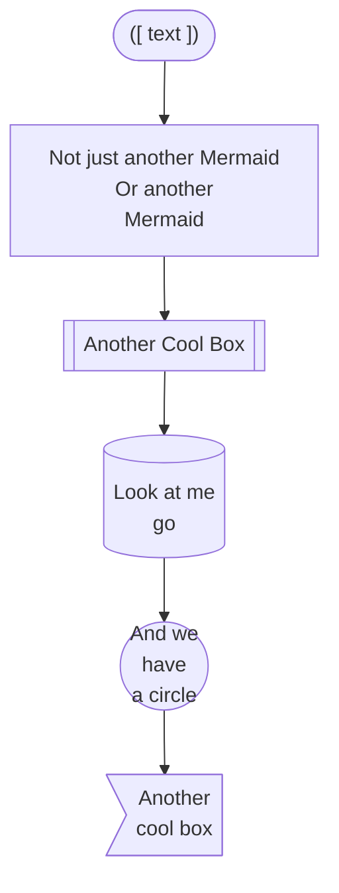
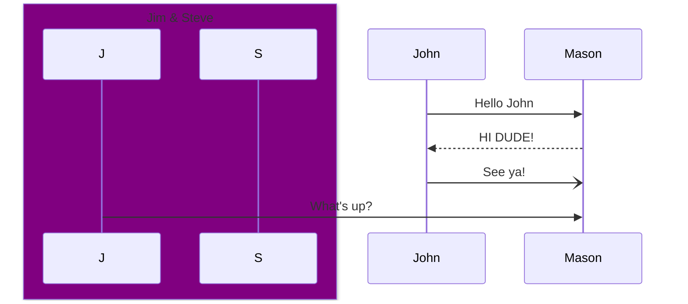
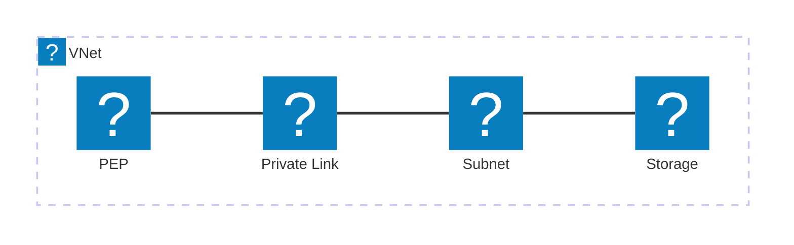

```mermaid
flowchart TD
    A(["`([  text ])`"])
    B["`Not just another Mermaid
       Or another
       Mermaid`"]
    C[[Another Cool Box]]
    D[("`Look at me
        go`")]
    E(("`And we 
        have 
    a circle`"))
    F>"`Another 
    cool box`"]


    A --> B
    B --> C
    C --> D
    D --> E
    E --> F
```

 
 

```mermaid
sequenceDiagram
box Purple Jim & Steve
participant J
participant S
end

    John->>Mason: Hello John
    Mason-->>John: HI DUDE!
    John-)Mason: See ya!
    J->>Mason: What's up?
```

 
 

```mermaid
architecture-beta
    group vnet(azure:virtual-networks)[VNet]

    service pep(azure:private-endpoints)[PEP] in vnet
    service subnet(azure:subnet)[Subnet] in vnet
    service st(azure:storage-accounts)[Storage] in vnet
    service pl(azure:private-link)[Private Link] in vnet

    st:L -- R:subnet
    subnet:L -- R:pl
    pl:L -- R:pep
    


```
